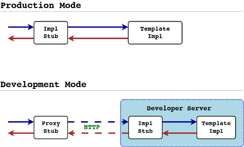

goats-html: Go Attribute-based Template System for HTML.

What's New in version 0.3?
==========================

goats-html version 0.3 introduces the capability to generate JavaScript
from the HTML template. At present, it generates JavaScript code with [Google
Closure Library](https://developers.google.com/closure/library/).

Together with this capability, version 0.3 also introduces officially the
support for [Protocol Buffers](https://developers.google.com/protocol-buffers/).
And this change breaks the compatibility with version 0.2!!! From version 0.3
a protocol buffer argument or variable must be followed with a "[pb]",
otherwise goats-html will simply treat it as a normal name and output it
verbatim.

The specifier "[pb]" should also be added in the go:import and followed by
the protocol buffer package name, like the following snippet:

```html
<html go:import="proto: mycompany.client.proto [pb] frontend.client.proto"
<div go:template="ProductCard"
	go:arg="product[pb]: proto.Product"
	go:var="resellers[pb]: product.resellers">
	<div>Name:</div>
	<div go:content="product.name"></div>
	<div>Price:</div>
	<div go:content="product.price"></div>
</div>
```

Note that the protocol buffer field names have to remain the same as
what are defined in the proto file. To support protocol buffer enum values,
a special rule was introduced in which if an identifier within a protocol
buffer reference experssion ends with a captialized first letter, then the
whole experssion will not be translated. Thus the following expression can
be correctly handled:

```html
<div go:if="product.category == proto.Product.Category_Clothes">
</div>
```

Also note that the generated Closure Library code uses JSON based wrapper
for protocol buffers. At present, a plugin for proto compiler named
[jspb](https://github.com/linuxerwang/jspb) is able to generate such wrapper
classes.

The design of the generated JavaScript ensures that when it was compiled
(together with the wrappers generated by jspb) with
[Google Closure Compiler](https://developers.google.com/closure/compiler),
the end library can be obfuscated meanwhile exposes enough APIs for any
JavaScript code to call (for instance, jQuery etc.). The following snippet
shows such an example in jQuery:

```javascript
$( document ).ready(function() {
	var jsonData = {
		"product": {
			"name": "Kid shoes size 7",
			"price": 14.99,
			"resellers": []
		}
	};
	// The name ProductListTemplate is exposed when obfuscated.
	var tmpl = new frontend.client.ProductListTemplate();
	// The name render is also exposed.
	// Always pass in a container element, and the raw JSON data.
	tmpl.render($('products-container'), jsonData);
});
```

What is goats-html?
==================

goats-html is an atribute-based template system specialized for HTML. It borrows
concepts from Template Attribute Language (TAL) (https://en.wikipedia.org/wiki/
Template_Attribute_Language) and implements its own set of attributes. A well-
known TAL system is used in Plone (and Chameleon as a standalone implementation:
http://chameleon.readthedocs.org/en/latest/). Goats-html is largely inspired by
Chameleon.

Differnt from most of other template system, goats-html does not maintain a run-
time rendering engine (AST). Instead, templates are preprocessed and translated
into Go language! For each template there will be a set of Go structs generated.
Your Go program should import and call these templates types hence the template
logic is statically linked into your binary.

Compared to classic template systems like velocity, etc., templates written in
goats-html is more readable and maintainable because of the ATL syntax. However,
due to its not having a runtime rendering engine (AST), it's hard to write
templates in goats-html in dev environment. Even changing one character of the
template forces you to rebuild your server and restart it. For this reason I
introduced a specially designed developer server which enable you to modify your
template without rebuilding/restarting your server. Hence there are dual execution
modes in goats-html: production mode and development mode:



For each template, the command goats generates a Go interface, a template
implementation, and a template proxy, both implements the same interface. When
you compile your server without the flag "--tags gots_devmod" the built binary
contains the template implementation. When it's compiled with the flag, the
stub will convert the template call into a HTTP request to the development
server. So in dev mode you don't need to rebuild/restart your server if you
modified the template (as long as the template interface was not changed).

Both the template generator and the dev server is provided the command goats.


Go-Get and Install
==================

Since version 0.2.0, goats-html switched to the normal go-get instead of debian
package. This is to make the installation easier because now most gophers are
more comfortable to work with go-get.

Install dependent packages
--------------------------

    $ go get golang.org/x/net/html
    $ go get github.com/howeyc/fsnotify

Install goats-html
------------------
To install goats-html, simply run these commands:

    $ go get -u github.com/linuxerwang/goats-html
    $ go install github.com/linuxerwang/goats-html/goats

Suppose you've added $GOPATH/bin to $PATH, you can build template with:

    $ goats gen --template_dir goats-html/example

The output directory is by default the same as the template directory, but
you can specify differently:

    $ goats gen --template_dir goats-html/example --output_dir goats-html/mypkg


Run the Example Program
=======================

Under your GOPATH folder (on my machine it's ~/go), run the following commands:

    $ cd $GOPATH
    $ go run goats-html/examples/main.go --benchmark --large

Benchmark example template:

    $ go run goats-html/examples/main.go --benchmark --small
    $ go run goats-html/examples/main.go --benchmark --large


Run the Example Server in Dev Mode
==================================

Under your GOPATH folder (on my machine it's ~/go), run the following commands:

    $ cd $GOPATH
    $ go run --tags goats_devmod goats-html/examples/server/main.go

visit the template: http://localhost:8000.


Tags and Attributes
===================

All goats-html attributes start with "go:". There are many such attributes and an
HTML tag can be attached by multiple attributes. However, not all attributes can
be attached to all HTML tags. If a tag was attached by multiple attributes,
there's an inherent execution order of them, regardless of their attaching order
on the tag. The following section lists all tags and corresponding attributes
with specific execution order.

ANY TAG:

  * go:template
  * go:arg (multiple)
  * go:var (multiple)
  * go:attr (multiple)

&lt;HTML&gt;:

  * go:import

Other TAGs:

  * go:if
  * go:for
  * go:content
  * go:replace
  * go:replaceable
  * go:switch
  * go:case
  * go:default
  * go:call
  * go:omit-tag


Template Built-in Functions:
============================

In goats-html templates, the following built-in functions can be used in
expressions such as go:var, go:arg, go:content:

* center
* cut
* debug
* floatformat
* join
* len
* ljust
* rjust
* title
* quote

We intented to implement filters like in Django template (using | as the filter
operator), and finished a primitive implementation which pass the expression
to go package "ast/parser" and parse the binary operator |. Unfortunately | is
the "bitwise or" in Go lang and it has lower precedence so such expressions
can't be correctly interpreted:

    go:if="price >= 10 && title|length > 20"

because && has higher precedence than |, the express is interpreted as:

    (price >= 10 && title)|(length > 20)

instead of:

    price >= 10 && (title|length) > 20

We don't want to force template authors to use parenthesis, so at present only
built-in function calls are accepted.


Examples
========

Template examples:

    <html>
      <div go:template="ProductCard"
           go:arg="product: proto.Product">
         <div>Name:</div>
         <div go:content="product.Name"></div>
         <div>Price:</div>
         <div go:content="product.Price"></div>
      </div>
    </html>

    <html go:template="HomePage"
          go:import="products/templets.html as product"
          go:arg="pageData: proto.PageData">
    <body>
      <p>My card:
        <div go:template="UserCard"
             go:arg="user: proto.User = pageData.loginUser"
             go:if="user.IsActive"
             go:var="age: time.Now().Year - user.Birthday.Year">
          <span go:content="title(user.Name)"></span>
          <div go:for="@idx, skill: user.skills">
            <span go:content="idx.Counter"><span go:content="skill">
          </div>
          <span>Age:<span> <span go:content="age"></span>
        </div>
        Items I sell:
        <div go:for="product: pageData.products"
             go:call="product#ProductCard">
        </div>
      </p>

      Your Friends:<hr>
      <p go:for="friend: pageData.Friends">
        <span go:content="friend.Name"></span>
        <div go:call="#UserCard"
             go:var="user: friend"></div>
      </p>

      <ul>
        <li go:for="product: pageData.products" go:content="product.Name"></li>
      </ul>

      <div go:for="product: pageData.products">
        <span go:content="product.Name"></span>
        <span go:content="product.Price"></span>
      </div>
    </body>
    </html>


Credits
=======

* linuxerwang (linuxerwang@gmail.com): Created the original system.
* nwlearning (nwlearning@gmail.com): Implemented most of the built-in template functions.
